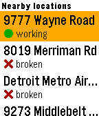
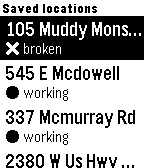

# mcbroken for pebble

A mcbroken client for pebble smartwatches.

 

Now you can conveniently check if the ice cream machine is broken on your wrist!

## build instructions
Install [uv](https://docs.astral.sh/uv/) and run:

```
uv tool install pebble-tool
pebble sdk install latest
```
if you haven't already.

Clone the repo and build:

```
git clone https://github.com/nubbybubby/pebble-mcbroken
cd pebble-mcbroken
pebble package install clay
pebble build
```

the .pbw file will be in the build directory.
